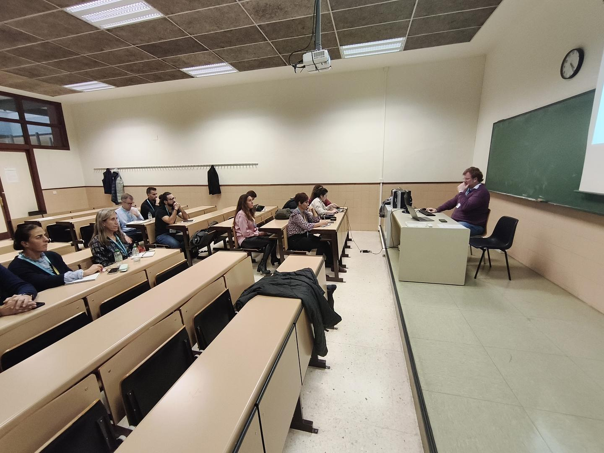
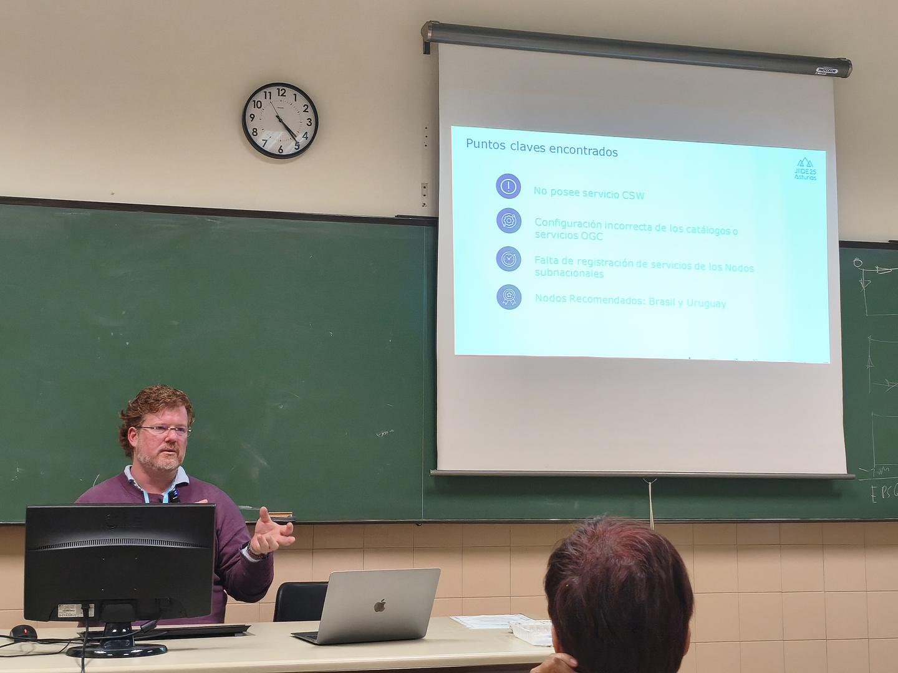
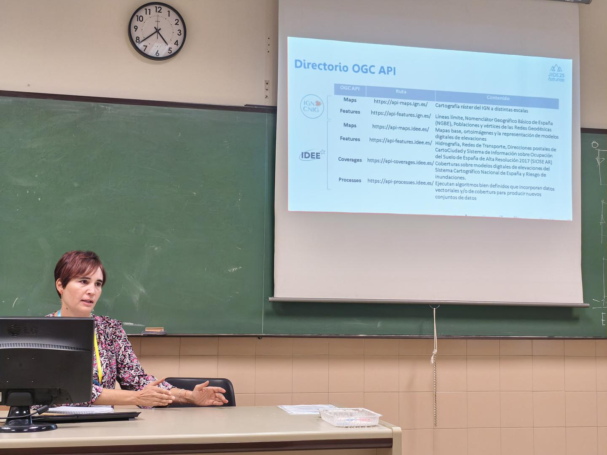

## Reunión ILAF en las JIIDE 2025

El próximo 13 de noviembre, en el marco de la XVI edición de las Jornadas Ibéricas de Infraestructuras de Datos Espaciales (JIIDE) 2025, organizaremos una sesión del ILAF.  [Programa](https://www.jiide.org/en/web/portal/programa.) de las JIIDE.

Fecha: 13 de noviembre de 2025, a las 16:00 - 16:45 (UTC+1).

Lugar: 
    Campus del Milán de Humanidades
    C/ Amparo Pedregal, s/n
    33011 Oviedo, Asturias

También hay la posibilidad de asistir virtualmente https://www.jiide.org/web/portal/sesiones-virtuales.   
[Programa](https://www.idee.es/resources/presentaciones/JIIDE25/Retransmision/13_Sala2.pdf) Sala 2.

#### Tema: **Implementación de las OGC API en los territorios de habla hispana y portuguesa.** 
 
Agenda

| Horario    | Presentación    | Ponente   | 
|--------------|--------------|--------------|
|16:00-16:10  | Bienvenida al ILAF. **OGC API’s dentro del contexto del ILAF**  |Joan Masó y Núria Julià [UAB-CREAF]|
|16:10-16:25  | **IDE Américas: Evaluación inteligente de madurez geoespacial mediante servicios OGC**  |Ariel Anthieni [OSGeo/KAN Territory & IT]|
|16:25-16:35  | **OGC API's en el IGN y el CNIG**       |Cecilia Poyatos Hernández [CNIG]|
|16:35-16:45  |Ronda de preguntas y comentarios  | |

#### Así fue la sesión ILAF en el JIIDE2025.

https://agora.ogc.org/c/overview-iberian-and-latin-american-forum/success-of-the-ilaf-event-in-the-jiide2025-oviedo

El evento ILAF en las JIIDE2025, ayer 13 de noviembre, tuvo una buena asistencia (considerando que había otras dos sesiones alternativas disponibles).

Comenzamos con un “Bienvenidos a ILAF. API de OGG en el contexto de ILAF”. El mensaje era: ¿Qué significa que he implementado las funcionalidades de la API de OGC? Es necesario mencionar the *Parts*. ¡Conocemos nueve de ellas!

En la “IDE Américas: Evaluación inteligente de la madurez geoespacial con servicios OGC (Ariel Anthieni [OSGeo / KAN Territory & IT]) vimos una herramienta para mostrar el estado de los catálogos de metadatos en América Latina y aprendimos sobre las actividades de la ONU para apoyar las iniciativas geoespaciales latinoamericanas.

En la ponencia «API OGC en IGN y CNIG» (Cecilia Poyatos Hernández [CNIG]) aprendimos sobre la evolución de los servicios del IGN (Instituto Nacional de Cartografía de España) desde *Web Services* hasta las *OGC API's*. En ocasiones se utiliza una interfaz; en otras, es necesaria una duplicación completa de los datos y el servicio.

!Pronto estarán disponibles la presentaciones!