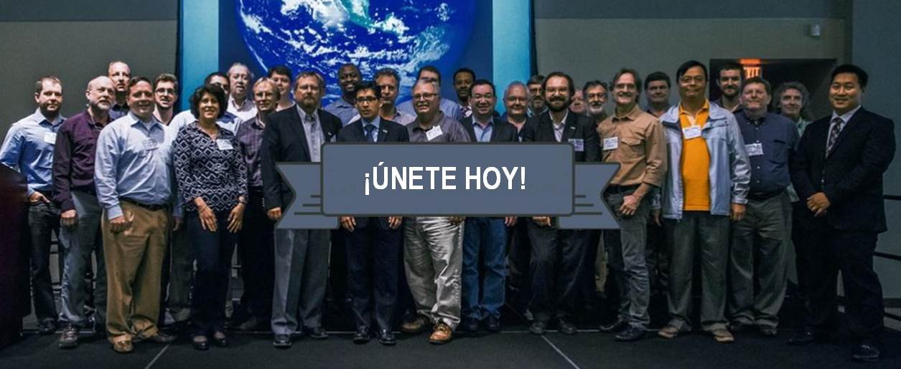

# ¿Qué es el Foro Iberico y Latinoamericano del OGC (ILAF)?

## Objetivos de ILAF
El Foro Ibérico y Latinomaericano de OGC (OGC ILAF) quiere abarcar la comunidad de habla hispana y portuguesa interesada en los desarrollos y objetivos de OGC. Engloba tanto a los miembros OGC como a los que, sin serlo, compartan intereses con los citados desarrollos y objetivos.
OGC ILAF se postula como:
* Un mecanismo de coordinación y comunicación con OGC sobre requerimientos de interoperabilidad y para la participación en los procesos de estandarización.
* Un medio para que OGC conozca y canalice las necesidades de interlocución y formativas en la comunidad de habla hispana y portuguesa.
* El interlocutor ante el Foro Europeo de OGC para coordinar cuestiones de interés en el marco europeo relacionadas con los procesos internacionales de OGC.

Ni más ni menos. Ver [*Charter*](Charter_OGC_Iberian_and_Latin-American_Forum_v5.doc) aprobado por OGC en verano de 2010
Ver [Folleto promocional](Leaflet_ILAF.pptx)