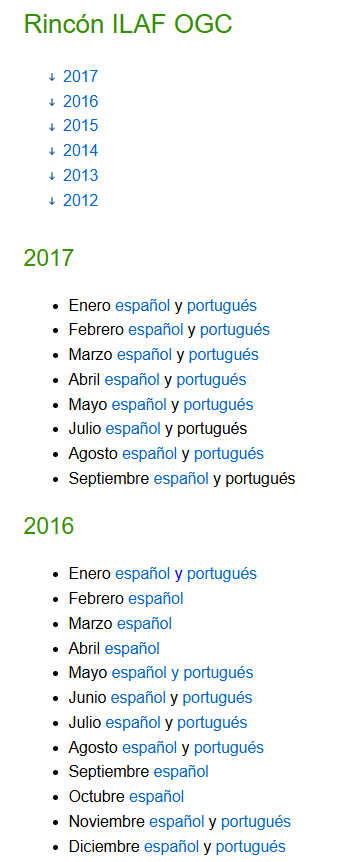
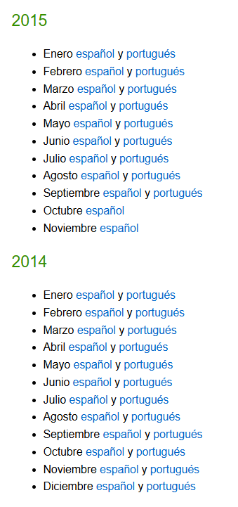
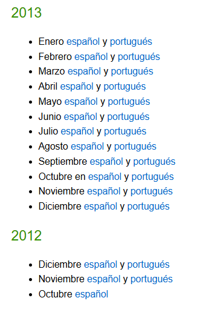

### El Rincón de ILAF

#### Presentación del rincón de ILAF OGC
Una de las razones de ser de ILAF es la incrementar la difusión de OGC en nuestro ámbito. Para ello, proponemos la puesta en marcha de una nota mensual llamada El rincón de ILAF OGC que pensamos distribuir entre publicaciones electrónicas del sector. Ya hemos contactado con SobreIDEs, IDE-LAC, Newsletter IDE Iberoamérica y el blog de la IDEE. Evidentemente, cada mes la publicaremos en nuestra twiki.
La nota mensual El rincón de ILAF OGC está formada por dos cuerpos: una parte informativa sobre algún aspecto de ILAF o OGC y una relación de las noticias OGC publicadas desde el mes anterior. Este es el ejemplo que hemos mostrado a nuestros primeros colaboradores:. El_rincon_de_ILAF_OGC-Setiembre_2012.doc
Asumimos la tarea de editar el El rincón de ILAF OGC Imma Serra (inmaculada.serra@cnig.es) y Joan Capdevila (joan.capdevila@seap.minhap.es). Agradecemos las sugerencias/aportaciones que querais hacernos llegar.
En el ejemplo, la parte informativa de la nota se refiere al estándar SLD, pero se puede hablar de muchas cosas. Los primeros números deberían presentar a ILAF y OGC antes de entrar en mayores detalles.
Proponemos los siguientes temas (si alguien quiere redactarlos o añadir nuevos temas, sólo tiene que editar esta misma página):

#### Noviembre 2012: Presentación de ILAF

El Foro Ibérico y Latinomaericano de OGC (ILAF OGC) se dirige a toda la comunidad de habla hispana y portuguesa interesada en los desarrollos y objetivos de OGC. Engloba tanto a los miembros OGC como a los que, sin serlo, compartan intereses con los citados desarrollos y objetivos.
ILAF OGC se postula como:
un mecanismo de coordinación y comunicación con OGC sobre requerimientos de interoperabilidad y para la participación en los procesos de estandarización.
un medio para que OGC conozca y canalice las necesidades de interlocución y formativas en la comunidad de habla hispana y portuguesa.
el interlocutor ante el Foro Europeo de OGC para coordinar cuestiones de interés en el marco europeo relacionadas con los procesos internacionales de OGC.
Ver [Charter](Charter_OGC_Iberian_and_Latin-American_Forum_v5.doc) aprobado por OGC en verano de 2010
Para participar puedes seguirnos en nuestra web o suscribirte a la lista del forum: ila.forum @lists.opengeospatial.org

#### Diciembre 2012: Descripción de OGC

El consorcio Open Geospatial (Open Geospatial consortium, Inc), conocido habitualmente como OGC, es un consorcio industrial internacional que agrupa a más de 470 compañías, agencias gubernamentales y universidades que quieren colaborar en el desarrollo de especificaciones de estándares de interfaz.
La colaboración se lleva a cabo mediante procesos de consenso y los desarrollos obtenidos son públicos.
Sus resultados son los estándares OpenGIS ® y OGC® (marcas registradas), que permiten soluciones interoperables que facilitan el acceso, la manipulación y el intercambio de información geográfica en la web, en servicios basados en la posición y en servicios móviles, y en general en el ámbito de las tecnologías de la información.
Los estándares permiten a los desarrolladores el que la información espacial compleja y los servicios relacionados puedan ser accedidos y utilizados por todo tipo de aplicaciones. La forma, el marco y el estado actual de los trabajo de OGC se sintetizan en el documento OGC Reference Model (ORM).
Leer las siguientes ediciones del Rincón de ILAF en http://external.opengeospatial.org/twiki_public/ILAFpublic/EdicionesRinconILAF

Se realizarón boletines del 2012 al 2017.

Ejemplo:
Abril 2015 [español](rinconILAF/Rincon_ILAF_Abril15_ES.pdf) y [portugués](rinconILAF/Rincon_ILAF_Abril15_PT.pdf)

